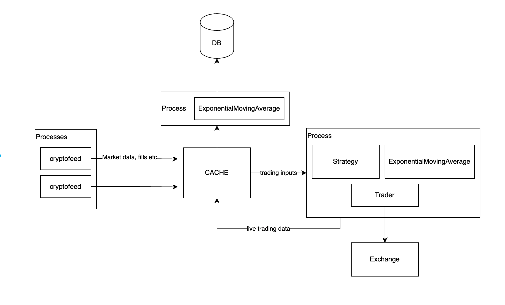
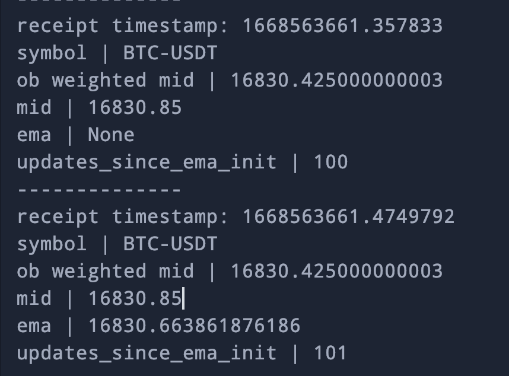

### A scalable implementation of online transforms and order book feature extraction

This is a simple and scalable implementation of 2 critical components of algo trading: the order book and exponential moving averages. This implementation illustrates the benefit for understanding of tech+quant+trading aspects while developing algo trading frameworks.


#### Features:
- CustomOrderBook class with utility quant functions
    - quant functions for alpha and trading execution  
    
- ExponentialMovingAverage class 
    - Same code for live and backtest
    - Memory efficient: no need to store an array of past data
    - Fast: no need to loop over past data

- Online compute
    - Offline moving statistics (like MA) have many downsides: need to store arrays, loop over them, don't represent full-history, high impact of outliers when they drop out of lookback
    - Online implementations have many benefits: only need to store 1 value due to recursive nature, always represent the full-history of data, impact of outliers is smoothed out


- Scalable architecture
    - Can be used in a live trading environment
    - Can be used in a backtest environment
    - Can be used in a distributed environment
    - Can be used in a single threaded environment
    




#### Running the script

Any recent Python+cryptofeed version would work. The only custom order book class included is gateio .
```bash
python run_data_listener.py -e GATEIO -s BTC-USDT ETH-USDT --key_id "<your_key_id>" --key_secret "<your_key_secret>"
```

Here an example of the ExponentialMovingAverage class. We set the required_n_warmups parameter to 100. The 
image below shows that at the 100th tick, the EMA finished warming up and turned from "None" to a value.



